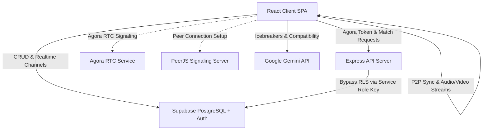

# Othrhalff Architecture

This document outlines the system architecture, frontend structure, backend services, and integration protocols that power the Othrhalff platform.

---

## 🏗️ System Topology & Tech Stack

Othrhalff utilizes a decoupled architecture where the client application communicates directly with Supabase for data and authentication, while a lightweight Node.js Express server acts as a proxy for credentials and administrative actions. 



### Technology Stack Summary

| Layer | Technology | Purpose |
| :--- | :--- | :--- |
| **Frontend** | Vite + React + TypeScript + Tailwind CSS | Fast-loading Single Page Application (SPA) with utility-first styling. |
| **Backend** | Node.js + Express.js | Proxy server for generating RTC tokens, initiating calls, and bypassing RLS for guest/admin tasks. |
| **Database & Auth** | Supabase (PostgreSQL with RLS) | Relational storage, user profiles, authentication, storage buckets, and realtime changes. |
| **Realtime Media** | Agora RTC SDK | Peer-to-peer audio and video calls, channel token generation, and state management. |
| **Co-activities** | PeerJS (P2P Data / Streams) | Syncing playback states, progress tracking, dynamic lyrics, and webcam streams during dates. |
| **AI Integration** | Google Gemini API (`gemini-2.5-flash`) | Generation of compatibility scores and personalized icebreakers directly on the client. |

---

## 💻 Frontend Architecture

The React client-side application is structured around views (routing-level containers), context providers (global state machinery), and standalone services.

### Directory Structure

```text
client/src/
├── components/     # Reusable UI elements (cards, forms, loaders, modals)
├── context/        # Core state engines (Auth, Call, Presence, Notifications, Toast)
├── data/           # Statically defined values, prompts, and quotes
├── lib/            # Initialization modules (Supabase, Agora, Gemini client config)
├── services/       # Decoupled utility operations and DB interaction scripts
├── types/          # Shared TypeScript models and schemas
├── utils/          # Formatting helpers, analytics trackers, and image compressors
└── views/          # Route views and page interfaces
```

### 🗂️ View Components (`client/src/views/`)

*   **`Landing.tsx`**: Public entry page displaying platform value propositions, key pillars, and call-to-action redirect links.
*   **`Login.tsx`**: Dual authentication page supporting Supabase Magic Links and Google OAuth redirects.
*   **`Onboarding.tsx`**: multi-step flow capturing profile details (interests, bio, looking for, dob, gender, and branch) with client-side image compression.
*   **`Home.tsx`**: The main swiping card interface for discovering profiles. Employs spring physics and filter modals for switching between "Campus" and "Global" queues.
*   **`Confessions.tsx`**: Anonymous feeds and interactive campus polls. Bypasses RLS restrictions for guest user submissions via an Express proxy.
*   **`Matches.tsx`**: Visual list of matched profiles, latest unread counts, and active chat previews.
*   **`Chat.tsx`**: Gradual profile reveal screen. Blurs partner avatars based on a calculated chemistry progression. Includes direct action buttons for Agora calling.
*   **`VirtualDate.tsx`**: Bento-grid hub routing users into synchronizable P2P activities like "Cinema Date" and "Music Date".
*   **`virtual-dates/CinemaDate.tsx`**: Synchronized watch room leveraging a custom YouTube iframe controller and PeerJS channels to broadcast plays, pauses, seeks, and drift adjustments.
*   **`virtual-dates/MusicDate.tsx`**: Shared karaoke and music player drawing tracks from JioSaavn, fetching synchronized lyrics from LRCLib, and broadcasting time-codes over PeerJS.
*   **`Profile.tsx`**: Management page for user preferences, campus verification, verification badges, and subscriptions.
*   **`Notifications.tsx`**: Dedicated center sorting profile likes, match warnings, and application events.
*   **`StaticPages.tsx`**: Collection of static routing layouts for corporate sections (Terms, Privacy, Developers, Contact).

---

### 🧠 State Management Contexts (`client/src/context/`)

```
  ┌─────────────────────────────────────────────────────────────┐
  │                        AuthContext                          │
  └──────────────────────────────┬──────────────────────────────┘
                                 │ Syncs JWT Token
                                 ▼
  ┌─────────────────────────────────────────────────────────────┐
  │                      Service Worker                         │
  └─────────────────────────────────────────────────────────────┘
  ┌──────────────────────┬──────────────────────┬───────────────┐
  │     CallContext      │   PresenceContext    │ Notification  │
  └──────────────────────┴──────────────────────┴───────────────┘
```

#### `AuthContext`
*   **Purpose**: Manages authenticated sessions, registration, and user profiles.
*   **State & Sync**: 
    *   Maintains a cache-first profile loop checking `localStorage` before DB fetching.
    *   Detects expired JWT tokens to prompt a custom `ForceLogoutCountdown`.
    *   Synchronizes active session authorization tokens with the Service Worker using non-blocking async messaging:
        ```typescript
        navigator.serviceWorker.ready.then(reg => {
          reg.active?.postMessage({ type: 'SET_AUTH_TOKEN', token: session.access_token });
        });
        ```

#### `CallContext`
*   **Purpose**: Orchestrates Agora audio/video call flows.
*   **Signaling & Ringer**:
    *   Fires native browser ringtone indicators and controls call dialog overlays.
    *   Enforces "User Busy" checks and drops incoming calls if a user is already active.
    *   Subscribes directly to real-time `call_sessions` table updates via Supabase and optimistic client signaling broadcats.

#### `NotificationContext`
*   **Purpose**: Listens to live user notifications.
*   **Debouncing**:
    *   Utilizes a local debouncer to group multiple near-simultaneous triggers (e.g., likes or matches within a 10s window) to avoid duplicate system popups.
    *   Connects to the Supabase `notifications` Postgres replication channel for high-fidelity messaging.

#### `PresenceContext`
*   **Purpose**: Tracks online status indicators across matched users.
*   **Presence Lifecycle**:
    *   Updates the `user_presence` table through a recurring 10-second heartbeat.
    *   Monitors document visibility changes (pausing heartbeats when backgrounded).
    *   Implements stale threshold eviction (evicts peers whose `last_seen` timestamp exceeds 20 seconds).
    *   Leverages `navigator.sendBeacon` for connection termination handling during window unload events:
        ```typescript
        window.addEventListener('beforeunload', () => {
          const blob = new Blob([JSON.stringify({ userId })], { type: 'application/json' });
          navigator.sendBeacon('/api/presence/offline', blob);
        });
        ```

#### `ToastContext`
*   **Purpose**: App-wide UI alert overlays. Supports progressive duration bars, custom warning levels (success, warning, error, info), and stack management.

---

### 🛠️ Client Services (`client/src/services/`)

*   **`auth.ts`**: Implements base database calls for checking profile existence and registering new accounts. Handles avatar resizing to a max of `600x600` and converts to Base64 at `82.5%` quality before upload.
*   **`blockService.ts`**: Exposes query operations against the `blocked_users` database schema. Handles listing active blocks, checking blocked/blocked-by relationships, and setting blocks to prevent visibility in feeds and swiping decks.
*   **`callSignaling.ts`**: Provides helper functions to safely structure peer signaling during a call. Wipes hanging call records in `call_sessions`, fires optimistic alerts via web sockets, fetches Agora channel configurations, and records call status indicators.
*   **`geminiService.ts`**: Calls Google's `@google/genai` model client-side (specifically `gemini-2.5-flash`). Translates profile parameters, target gender, and common hobbies into icebreaker starters and compatibility breakdowns.
*   **`data.ts`**: *Deprecated/Stub*. Retained strictly for legacy code compatibility.

---

## ⚙️ Backend Server Role & Endpoints

The backend server is built using Node.js and Express. Its primary role is to perform sensitive operations requiring system credentials (such as service role keys or Agora app certificates) and proxy transactions that bypass Row-Level Security.

### Request Validation Middleware
The middleware `verifySupabaseToken` intercepts and checks authorization headers:
1. Grabs `Authorization: Bearer <token>` from incoming headers.
2. Directs validation to the anonymous Supabase client (`supabaseAuthClient.auth.getUser(token)`).
3. Attaches the validated user profile data onto the Express request object for subsequent controller execution.

### 🌐 Key Server API Endpoints

#### `POST /api/agora-token`
Generates authorization credentials for Agora channels.
*   **Input**: `channelName`, `uid`, `role` (publisher/subscriber).
*   **Action**: Calls Agora's `RtcTokenBuilder.buildTokenWithUid` using `AGORA_APP_ID` and `AGORA_APP_CERTIFICATE`. Set with a standard privilege expiration window.

#### `POST /api/initiate-call`
Initializes database signaling and returns media channel credentials.
*   **Input**: `targetUserId`.
*   **Action**: Creates a unique Agora channel name, requests token creation, inserts call session indicators, and returns credentials to the caller.

#### `POST /api/accept-match`
Enforces administrative matching operations bypasses.
*   **Input**: `targetUserId`, `currentUserId`.
*   **Action**: Uses the `SUPABASE_SERVICE_ROLE_KEY` to write directly to the `matches` and `likes` schemas, bypassing active RLS rules.

#### `POST /api/post-guest-confession`
Allows guest users to publish confessions without signing up.
*   **Input**: `college`, `branch`, `text`, `imageUrl`, `type`, `pollOptions`.
*   **Action**: Maps the confession to a placeholder guest user ID (`a3e96230-6a78-4215-bcd0-882e1af61127`) and inserts the confession using the bypass admin client. Checks and enforces a client rate-limit of 1 post/day for guest instances.

---

## 🔄 Integration Protocols

The communication lifecycle follows three pathways depending on the action's privilege requirements:

```
┌─────────────────────────────────────────────────────────────────────────┐
│                                CLIENT                                   │
└───────────┬──────────────────────────┬─────────────────────────┬────────┘
            │                          │                         │
            │ 1. Direct Queries        │ 2. Credentials          │ 3. P2P Sync
            ▼                          ▼                         ▼
┌───────────────────────┐  ┌───────────────────────┐  ┌───────────────────────┐
│     SUPABASE DB       │  │      EXPRESS API      │  │        PEERS          │
│   (Postgres + RLS)    │  │  (Agora/RLS Bypass)   │  │   (PeerJS / WebRTC)   │
└───────────────────────┘  └───────────────────────┘  └───────────────────────┘
```

1.  **Direct Client-to-Supabase Channel**: Normal database reads, writes, and real-time event notifications occur directly between the client and Supabase using client API keys. Row-Level Security (RLS) ensures data isolation.
2.  **Express Auth Proxy Channel**: Administrative operations, such as bypasses for guest posts, match generation, or certificate token production, are delegated to the Express backend. The backend signs updates using the Supabase Service Role Key.
3.  **Direct P2P Client Synchronization**: During co-activities (Virtual Dates), media play/pause states, cursor positions, playback locations, and webcam streams are sent directly between client browsers using PeerJS signaling and WebRTC data channels. This ensures zero-server-load media synchronization.
