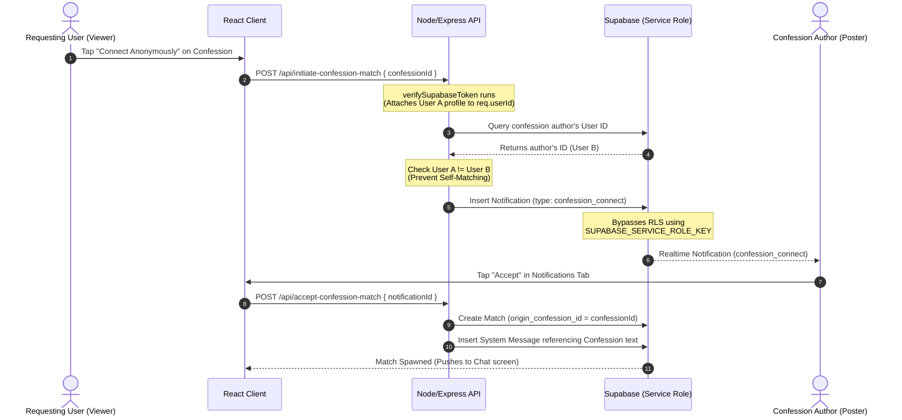

# Othrhalff Core Feature Guides

This document provides in-depth documentation on the functional mechanics, business logic, database dependencies, and frontend implementations for Othrhalff's core user features. 

---

## 1. Ghost Chemistry Matching (Gradual Profile Reveal)

Othrhalff's matching experience is built around removing immediate appearance-based bias. By default, matched user profiles are obscured, and their visual identity is gradually disclosed as meaningful conversation develops.

### 🎨 Concept: Look-Bias Mitigation
When two users match (either through the campus swiping queue or a confession acceptance), their avatars and real names are hidden. The avatar is heavily obscured using CSS blur filters. As the users message each other, a **Chemistry Meter** increases. Once milestones are crossed, the blur decreases, culminating in a complete reveal.

```
[Start Match] ────────> [Stage 1: Icebreaker] ────────> [Stage 2: Connection] ────────> [Stage 3: Chemistry] ────────> [Reveal Countdown] ────────> [Fully Unblurred]
(Max Blur: 24px)        (Active Chatting)               (Bio Unlocked)                  (Compatibility Score)           (24-Hour Timer)                 (0px Blur & Real Name)
```

---

### ⚙️ Technical Mechanics & Progression Stages
The profile reveal state is controlled dynamically by calculating the count of active messages exchanged in `public.messages` for the specific `match_id`.

#### Progressive Disclosure Milestones

| Stage | Message Range | CSS Blur Radius | Unlocked Metadata | Purpose |
| :--- | :--- | :--- | :--- | :--- |
| **Stage 1: Icebreaker** | 0 – 10 messages | `blur(24px)` | Anonymous ID, basic interests array | Initial greeting, playing AI icebreaker games |
| **Stage 2: Connection** | 11 – 30 messages | `blur(16px)` | Personal bio text, academic branch/year | Establishing common grounds & shared values |
| **Stage 3: Chemistry** | 31 – 50 messages | `blur(8px)` | Compatibility percentage, verification status | Direct interaction, preparing for video/audio call |
| **Stage 4: Reveal Milestone** | 50+ messages | `blur(4px)` | Mutual unblur button activated | Consent gate reached; timer begins upon mutual click |

#### CSS & Styling Application
Avatars are rendered dynamically using Tailwind classes and inline styles based on the current blur level:

```tsx
// Frontend representation of blurred avatar
export const BlurredAvatar = ({ src, blurRadius }: { src: string; blurRadius: number }) => {
  return (
    <div className="relative overflow-hidden rounded-full w-20 h-20 border border-white/10">
      
      {blurRadius > 10 && (
        <div className="absolute inset-0 flex items-center justify-center bg-black/40">
          <span className="text-xs font-semibold text-neon/90 tracking-wider">GHOST</span>
        </div>
      )}
    </div>
  );
};
```

---

### ⏳ Reveal Trigger & Countdown
When a match crosses **50 active messages** or if both users trigger the **"Request Reveal"** consent button, a database entry initiates the final unblur sequence.

1. **Mutual Consent Check**: Both users must tap the "Reveal Profile" button in their chat screen. Tapping this sends an update query to `public.matches`:
   ```sql
   UPDATE public.matches 
   SET 
     user1_reveal_consent = TRUE WHERE id = $1 AND user1_id = auth.uid();
   -- and similarly for user2
   ```
2. **Countdown Trigger**: A PostgreSQL trigger detects when both `user1_reveal_consent` and `user2_reveal_consent` are `TRUE` (or when the message count threshold of 50 is met) and updates `reveal_triggered_at` with the current UTC timestamp:
   ```sql
   UPDATE public.matches 
   SET reveal_triggered_at = timezone('utc', now()) 
   WHERE id = match_id AND user1_reveal_consent = TRUE AND user2_reveal_consent = TRUE;
   ```
3. **24-Hour Timer**: The client application checks the elapsed time since `reveal_triggered_at` and displays a countdown timer:
   ```typescript
   const getRemainingTime = (revealTriggeredAt: string) => {
     const duration = 24 * 60 * 60 * 1000; // 24 hours in ms
     const elapsed = Date.now() - new Date(revealTriggeredAt).getTime();
     const remaining = duration - elapsed;
     return remaining > 0 ? remaining : 0;
   };
   ```
   * During the 24-hour countdown, a lock icon with a ticking timer (e.g., `18:42:09`) is shown.
   * Once the remaining time reaches `0`, the avatar unblurs completely (`blur(0px)`) and the header swaps out the user's `anonymous_id` (e.g., *Anon Panda*) for their verified `real_name`.

---

## 2. Pulse-to-Ghost Bridge (Confession Matching)

The **Pulse-to-Ghost Bridge** converts passive interaction on the anonymous live feed (Pulse) into active private chat rooms (Ghost Matches).



### 👤 User Flow
1. While scrolling the anonymous campus feed, a user (User A) reads an interesting confession.
2. User A clicks the glassmorphic **"Connect Anonymously"** button on the card.
3. User A's client makes an authenticated request to the Express backend.
4. The confession author (User B) receives a real-time connection request notification.
5. If User B clicks **"Accept"**, an anonymous Ghost Chat is spawned, linking the two users together.

---

### 🖥️ Backend API Operations (`server/index.js`)

#### `POST /api/initiate-confession-match`
Enforces rate-limits, checks for self-matching, and posts a secure request notification.

```javascript
app.post('/api/initiate-confession-match', verifySupabaseToken, async (req, res) => {
  const { confessionId } = req.body;
  const initiatorId = req.userId; // Provided by auth token middleware

  try {
    const supabase = createClient(process.env.SUPABASE_URL, process.env.SUPABASE_SERVICE_ROLE_KEY);

    // 1. Fetch the target confession and its author ID
    const { data: confession, error: fetchErr } = await supabase
      .from('confessions')
      .select('id, user_id, content')
      .eq('id', confessionId)
      .single();

    if (fetchErr || !confession) {
      return res.status(404).json({ error: 'Confession not found' });
    }

    const targetUserId = confession.user_id;

    // 2. Prevent self-matching
    if (initiatorId === targetUserId) {
      return res.status(400).json({ error: 'You cannot connect with your own confession' });
    }

    // 3. Prevent duplicate requests
    const { data: existingNotif } = await supabase
      .from('notifications')
      .select('id')
      .eq('user_id', targetUserId)
      .eq('type', 'confession_connect')
      .eq('data->>confession_id', confessionId)
      .eq('data->>initiator_id', initiatorId)
      .single();

    if (existingNotif) {
      return res.status(400).json({ error: 'Connection request already sent' });
    }

    // 4. Create notification for the author (Bypasses RLS)
    const { error: notifErr } = await supabase
      .from('notifications')
      .insert({
        user_id: targetUserId,
        type: 'confession_connect',
        title: 'New Anonymous Connection',
        message: 'Someone wants to connect regarding your confession.',
        data: {
          confession_id: confession.id,
          confession_snippet: confession.content.substring(0, 60) + '...',
          initiator_id: initiatorId
        }
      });

    if (notifErr) throw notifErr;

    res.json({ success: true, message: 'Connection request sent successfully' });
  } catch (error) {
    console.error('Error initiating confession match:', error);
    res.status(500).json({ error: error.message });
  }
});
```

---

### 🎨 Frontend UI Themed Indicators
To separate traditional swipe matches from confessions matches, the UI applies themed markers.

1. **Matches Queue (`client/src/views/Matches.tsx`)**:
   Matches that contain a non-null `origin_confession_id` render with a custom neon speech bubble icon and a quote snippet.
   ```tsx
   {match.origin_confession_id && (
     <div className="flex items-center gap-1.5 mt-1 text-[11px] text-neon/90 font-medium bg-neon/10 px-2 py-0.5 rounded-md border border-neon/20 w-fit">
       <MessageSquare className="w-3 h-3 text-neon" />
       <span>Connected via Confession</span>
     </div>
   )}
   ```
2. **Chat Screen Header & Background Theme**:
   The chat window renders a banner at the top of the messages history showing a snippet of the originating confession:
   > **Connected via Confession:** *"I'm pretty sure the librarian knows I've been hiding snacks in the basement study rooms..."*

---

## 3. Sparx Hub (Campus Activity Feed & Radar)

The **Sparx Hub** is Othrhalff's visual activity dashboard, hosting vertical multimedia updates, custom image creations, and geolocated student density mapping.

```
┌────────────────────────────────────────────────────────────────────────┐
│                              SPARX HUB                                 │
├───────────────────────┬────────────────────────────────────────────────┤
│                       │                                                │
│   1. Campus Glimpses   │   3. Campus Heat Map (Radar)                   │
│   (Vertical Stories)  │   - Geolocation checks against boundary box    │
│   - Expire in 24 hrs  │   - Aggregates anonymous zone densities        │
│   - Double-tap: ❤️/🔥  │   - Renders pulsing SVG neon hotspots          │
│                       │                                                │
├───────────────────────┴────────────────────────────────────────────────┤
│   2. Glimpse Creator (Viewfinder)                                      │
│   - mediaDevices API (Front/Back Camera toggle)                        │
│   - Image capture & Canvas text caption overlay                        │
│   - Gallery local storage upload fallback                              │
└────────────────────────────────────────────────────────────────────────┘
```

---

### 🎥 Glimpses (Vertical Stories Feed)
Glimpses are 24-hour temporary media posts displayed in a vertical scrolling TikTok-style format.

* **Layout Mechanics**: Full-height frames `h-[100dvh]` set with `snap-y snap-mandatory` to ensure snappy scrolling.
* **Gestural Tutorial Overlay**: On first launch of the hub, the client checks `localStorage`:
  ```typescript
  const [showTutorial, setShowTutorial] = useState(
    () => !localStorage.getItem('othrhalff_seen_stories_tutorial')
  );

  const dismissTutorial = () => {
    localStorage.setItem('othrhalff_seen_stories_tutorial', 'true');
    setShowTutorial(false);
  };
  ```
  If `showTutorial` is true, an animated SVG hand moves upwards across the screen alongside a pulsating label *"Swipe up to discover campus moments."*
* **Double-Tap Reaction (❤️ / 🔥)**:
  Double-tapping a story container intercepts the event and executes a database callback while displaying floating animated icons rising up the screen:
  ```tsx
  const handleDoubleTap = async (glimpseId: string, reactionType: 'heart' | 'fire') => {
    // Optimistic UI updates
    triggerFloatingParticles(reactionType);
    
    // Call database function to increment reaction count
    await supabase.rpc('increment_glimpse_reaction', { 
      glimpse_id: glimpseId, 
      reaction_type: reactionType 
    });
  };
  ```
* **Story Expiration**: Built using a daily automated Postgres cron job executing an deletion query:
  ```sql
  DELETE FROM public.glimpses WHERE created_at < NOW() - INTERVAL '24 hours';
  ```

---

### 📷 Glimpse Creation (In-App Viewfinder)
Enables immediate camera input using HTML5 media device streams with styling filters.

#### Media Capture & Lens Swapping
The capture interface leverages `navigator.mediaDevices.getUserMedia` to toggle front and back sensors.

```typescript
export const CameraViewfinder = () => {
  const videoRef = useRef<HTMLVideoElement>(null);
  const [stream, setStream] = useState<MediaStream | null>(null);
  const [facingMode, setFacingMode] = useState<'user' | 'environment'>('user');

  const startCamera = async (mode: 'user' | 'environment') => {
    if (stream) {
      stream.getTracks().forEach(track => track.stop());
    }
    try {
      const mediaStream = await navigator.mediaDevices.getUserMedia({
        video: { facingMode: mode },
        audio: false
      });
      setStream(mediaStream);
      if (videoRef.current) {
        videoRef.current.srcObject = mediaStream;
      }
    } catch (err) {
      console.error("Camera access failed:", err);
    }
  };

  const toggleCamera = () => {
    const nextMode = facingMode === 'user' ? 'environment' : 'user';
    setFacingMode(nextMode);
    startCamera(nextMode);
  };

  useEffect(() => {
    startCamera(facingMode);
    return () => stream?.getTracks().forEach(t => t.stop());
  }, []);

  return (
    <div className="relative w-full h-[60vh] bg-black rounded-3xl overflow-hidden border border-white/10">
      <video ref={videoRef} autoPlay playsInline muted className="w-full h-full object-cover" />
      <button onClick={toggleCamera} className="absolute bottom-4 right-4 p-3 bg-black/60 rounded-full border border-white/20">
        Swap Camera
      </button>
    </div>
  );
};
```

#### Canvas Composition & Caption Rendering
Capturing a frame writes the video feed buffer to a Canvas element, applies a custom text caption overlay, and converts the resulting canvas back into a compressed image blob:

```typescript
const captureAndCompileImage = (captionText: string) => {
  const video = videoRef.current;
  if (!video) return;

  const canvas = document.createElement('canvas');
  canvas.width = video.videoWidth;
  canvas.height = video.videoHeight;
  const ctx = canvas.getContext('2d');

  if (ctx) {
    // 1. Draw raw camera frame
    ctx.drawImage(video, 0, 0, canvas.width, canvas.height);

    // 2. Render glassmorphic overlay for caption
    ctx.fillStyle = 'rgba(0, 0, 0, 0.4)';
    ctx.fillRect(0, canvas.height - 100, canvas.width, 100);

    // 3. Write User Text Overlay
    ctx.font = 'bold 32px sans-serif';
    ctx.fillStyle = '#ffffff';
    ctx.textAlign = 'center';
    ctx.shadowColor = 'rgba(0,0,0,0.6)';
    ctx.shadowBlur = 8;
    ctx.fillText(captionText, canvas.width / 2, canvas.height - 45);

    // 4. Output compressed file payload
    canvas.toBlob((blob) => {
      if (blob) {
        uploadGlimpseFile(blob);
      }
    }, 'image/jpeg', 0.85); // 85% compression balance
  }
};
```

* **Fallback Mechanism**: If the user blocks camera permission prompts, the UI renders a central gallery select button connected to a hidden file input `<input type="file" accept="image/*" />` to permit manual gallery uploads.

---

### 🗺️ Campus Heat Map (Interactive Radar)
The radar tracks active campus nodes anonymously and renders activity density without storing individual coordinate histories.

#### Geolocation Bounding Boxes
A client tracking service fetches the user's coordinate and determines their active campus sector.

```typescript
const CAMPUS_SECTORS = {
  LIBRARY: { latMin: 12.9715, latMax: 12.9730, lngMin: 77.5940, lngMax: 77.5955 },
  DORMS:   { latMin: 12.9740, latMax: 12.9755, lngMin: 77.5970, lngMax: 77.5985 },
  QUADS:   { latMin: 12.9690, latMax: 12.9705, lngMin: 77.5910, lngMax: 77.5925 }
};

const checkSector = (lat: number, lng: number): string | null => {
  for (const [sectorName, bounds] of Object.entries(CAMPUS_SECTORS)) {
    if (lat >= bounds.latMin && lat <= bounds.latMax && lng >= bounds.lngMin && lng <= bounds.lngMax) {
      return sectorName;
    }
  }
  return null;
};
```

1. **Anonymous Geopings**: Every 5 minutes, the client requests coordinates. If inside a sector, a request hits `/api/radar/ping` containing *only* `{ zoneId: 'LIBRARY' }`. The request carries no User ID to protect user privacy.
2. **Neon Hotspot Rendering**: Sector densities are calculated by counting the number of pings received within the last 15 minutes. The frontend SVG map scales these zones and applies glowing animations based on active density:
   ```xml
   <!-- Pulsing zone circle inside the SVG map component -->
   <g class="campus-zone" data-density="high">
     <!-- Static Zone Core -->
     <circle cx="150" cy="220" r="12" fill="#ff007f" />
     <!-- Glowing Outer Pulse Ring -->
     <circle cx="150" cy="220" r="28" fill="none" stroke="#ff007f" stroke-width="2" class="animate-radar-pulse" />
   </g>
   ```

---

## 4. Duo Dates (Private Co-Activities)

**Duo Dates** provides direct, low-latency synchronized watchparties and music rooms directly inside match chat sessions.

```
       HOST CLIENT                                         VIEWER CLIENT
┌─────────────────────────┐                             ┌─────────────────────────┐
│  YouTube / JioSaavn     │                             │  YouTube / JioSaavn     │
│  Playback Engine        │                             │  Playback Engine        │
└───────────┬─────────────┘                             └───────────▲─────────────┘
            │ 1. Play/Pause/Seek                                    │ 3. Sync Action
            ▼                                                       │
   ┌──────────────────┐         2. WebRTC Data Channel     ┌────────┴─────────┐
   │ PeerJS Instance  ├───────────────────────────────────>│ PeerJS Instance  │
   └──────────────────┘                                    └──────────────────┘
            │                                                       │
            │ <─── Realtime Webcam Video Stream (Agora RTC) ──────> │
```

---

### 🎬 Synchronized Cinema Date
Lets matches sync playback of YouTube streams side-by-side with an audio/video chat overlay.

#### Player Control Synchronization Engine (PeerJS)
One user coordinates playback by sending event notifications over WebRTC DataChannels.

* **Triggering Event Broadcasts (Host)**:
  ```typescript
  const handleHostPlay = () => {
    broadcastData({
      type: 'SYNC_PLAYER',
      action: 'play'
    });
  };

  const handleHostSeek = (seconds: number) => {
    broadcastData({
      type: 'SYNC_PLAYER',
      action: 'seek',
      time: seconds
    });
  };
  ```
* **State Updates & Drift Correction (Viewer)**:
  To handle buffering differences, the Host continuously updates the playhead position every 2 seconds. The Viewer client monitors drift:
  ```typescript
  const handleSyncMessage = (message: any) => {
    if (message.type === 'SYNC_PLAYER') {
      const player = playerRef.current;
      if (!player) return;

      if (message.action === 'play') {
        player.playVideo();
      } else if (message.action === 'pause') {
        player.pauseVideo();
      } else if (message.action === 'seek') {
        player.seekTo(message.time, true);
      } else if (message.action === 'time_update') {
        const drift = Math.abs(player.getCurrentTime() - message.time);
        // If playback is out of sync by more than 1.5 seconds, force seek adjustment
        if (drift > 1.5) {
          player.seekTo(message.time, true);
        }
      }
    }
  };
  ```

#### WebRTC Video/Audio Overlay (Agora RTC)
The webcam feeds run inside floating panels that lay over the video window. Video feeds are handled by Agora's low-latency audio/video RTC channel.

* **Drag-and-Resize Overlay Controls**:
  ```tsx
  // Floating webcam window
  <div
    style={{ left: `${camPos.x}px`, top: `${camPos.y}px` }}
    className="absolute z-30 w-32 h-24 rounded-2xl overflow-hidden border border-neon/50 shadow-2xl cursor-move"
    onMouseDown={(e) => handleCamMouseDown(e)}
    onTouchStart={(e) => handleCamTouchStart(e)}
  >
    <AgoraVideoFeed track={localVideoTrack} />
  </div>
  ```

---

### 🎵 Synchronized Music Jam
Provides synchronized search, playback queue, and scrolling karaoke-style lyrics.

#### Streaming Strategy
* **JioSaavn Search & Stream Proxy**: Searches hit a JioSaavn wrapper API. 
* **Blob Caching Logic (Anti-429 Rate Limiter)**:
  Instead of progressive HTTP range loading (which triggers Cloudflare/CDN rate limit bans during scrubs), the client fetches the entire audio track block as a Blob first, then converts it into a local Object URL:
  ```typescript
  const fetchAudioBuffer = async (mediaUrl: string) => {
    const res = await fetch(mediaUrl);
    const audioBlob = await res.blob();
    const localBlobUrl = URL.createObjectURL(audioBlob);
    
    if (audioRef.current) {
      audioRef.current.src = localBlobUrl;
      audioRef.current.load();
    }
  };
  ```

#### Lyrics Synchronizer (LRCLib Integration)
1. **LRC Format Fetching**: Queries `lrclib.net/api/search` with the song metadata to get timestamped lines:
   ```
   [00:12.30] I was looking for a breath of fresh air
   [00:16.85] Then I found you standing there
   ```
2. **Lyric Scroll Sync**:
   LRC lines are parsed into an array of `{ time: number; text: string }`. As the HTML5 Audio element fires `onTimeUpdate`, the active index matches:
   ```typescript
   const handleLyricsSync = (currentTime: number) => {
     const activeIndex = lyricsArray.findIndex(
       (line, i) => currentTime >= line.time && (!lyricsArray[i + 1] || currentTime < lyricsArray[i + 1].time)
     );

     if (activeIndex !== -1 && activeIndex !== currentLyricIndex) {
       setCurrentLyricIndex(activeIndex);
       // Scroll active lyric line to center of container
       const element = document.getElementById(`lyric-line-${activeIndex}`);
       element?.scrollIntoView({ behavior: 'smooth', block: 'center' });
     }
   };
   ```
